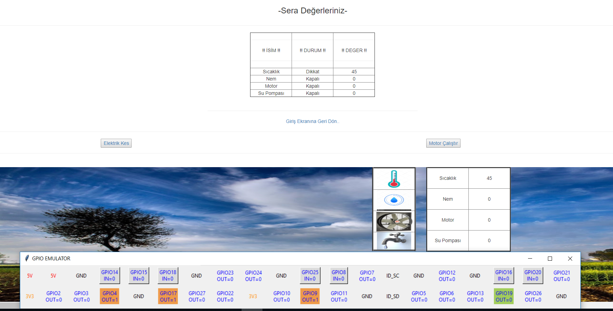

# Sera Otomasyonu
Raspberry Pi üzerinde Python ve Flask ile sera yönetim sistemi,

## Projenin Genel Tanımı Ve Amacı
Sera otomasyonu ile kullanmak isteyen ilgili kişinin serasını web üzerinden kontrol etmesini sağlamak için geliştirilmiş, python kullanılarak oluşturulmuş emulatör ile kontrol edilmiş porjedir.

# Kurulum Ve Kullanım
İlk olarak run.py adlı dosyayı python üzerinden çalıştırarak web sitemizi localhost:5000 üzerinde aktif ediniz.
Hemen sonra sera.py dosyasını python üzerinde çalıştırarak EmulatorGUI'yi aktif ediniz. Göreceğiniz üzere emulatör üzerindeki değişiklikler ile web üzerinden sqlite3 ile veri alış-verişi başarıyla sağlanacaktır.

## Kullanılan Teknolojiler
- Python
- Windows 10 / (İstenirse Ubuntu üzerinden yapabilir. )
- Visual Studio Code
- Php
- JavaSctript
- Sqlite3
- Flask-Sqlalchemy
- HTML

## Sistem bileşen diyagramı

## Kullanılan Kaynaklar
Daha çok internet tabanlı bir araştırma ile gittiğim için kararlaştırdığımız 3 farkı web sitesi kaynak olarak kullanılıyor. Tüm site ve kaynak bilgilerine aşağıdaki linklerden ulaşabilirsiniz.
- https://www.codementor.io/garethdwyer/building-a-crud-application-with-flask-and-sqlalchemy-dm3wv7yu2
- https://www.tutorialspoint.com/flask/flask_sqlite.htm
- https://medium.com/@aliciagilbert.itsimplified/a-slick-crud-application-built-using-python-with-flask-and-sqlite3-to-teach-simple-mysql-queries-bd75e1109582
- https://www.youtube.com/watch?v=4dV7mMZzCYI
- https://www.youtube.com/watch?v=ETtPfYmSZ2w&list=PLIHume2cwmHehcxQE1XZieL21syR3m3tR&index=31
## Kullanılan Kütüphaneler
- from EmulatorGUI import GPIO
- import RPi.GPIO as GPIO
- import traceback
- import time
- import sqlite3
- from flask import Flask, render_template, request
- import sqlite3 as sql

## Proje Gerçeklemesi Hakkında
Projemiz simülasyon ve web tabanlı işleme olması dolayısıyla gerçeklemeye dökmeyeceğiz. Fakat gerçek bir Raspberry Pi üzerinde kurmak ve uygulamak isteyen kişiler sera.py içerisindeki from EmulatorGUI import GPIO kütüphanesini silerek yerine #import RPi.GPIO as GPIO kütüphanesini eklemeli ve Rasberry Pi içerisine uygun şekilde aktarmalıdır.

## Projenin uygulama aşamaları
- Proje içi sırasıyla aşığıdaki gibidir. (Sürekli güncellenecektir.)
1) İlk olarak python ile sqlite3 bağlantısı yapılmaya çalışılıp veri tabanı üzerinde güncelleme işlemi yapılmaya çalışıldı. Ve yapıldı.
2) HTML sayfaları oluşturuldu ve görselleme arayüzü yapıldı.
3) Python kullanılarak Emulatör üzerindeki butonlar ile veri tabanı güncellemesi yapıldı.
4) Python dosyası ile HTML sayfasına veri göndermesi sağlandı.
5) En çok zorlanılan konu ise bu verileri tabloda istenilen yerlereyazmak oldu ve yerleştirmeye çalışmatı. Üstesinden ise bir "for" dönüsü ile .py uzantılı dosyadan veri çekmeyle gelindi.
6) En son html sayfalarına görüntüler eklenerek daha güzel bir görünüm sağlandı.
7) Şu an için her şey tamam fakat "Sera Resmi" üzerinde tablolara ilgili yerlere gelinmemektedir. Bu işlem biraz zaman alabilir. (üzerinde çalışılıyor.)
## Uygulama İçi Görüntüler
- Giriş Sayfası

- İlk standart durumlar

- Sıcaklık değerini emulatörden değiştirdikten sonraki durum

- Elektrik Ver Butonu İle Veri tabanına etki etme

- Motor Çalıştır Butonu İle Veri tabanına etki etme

- Sera Görselleme

